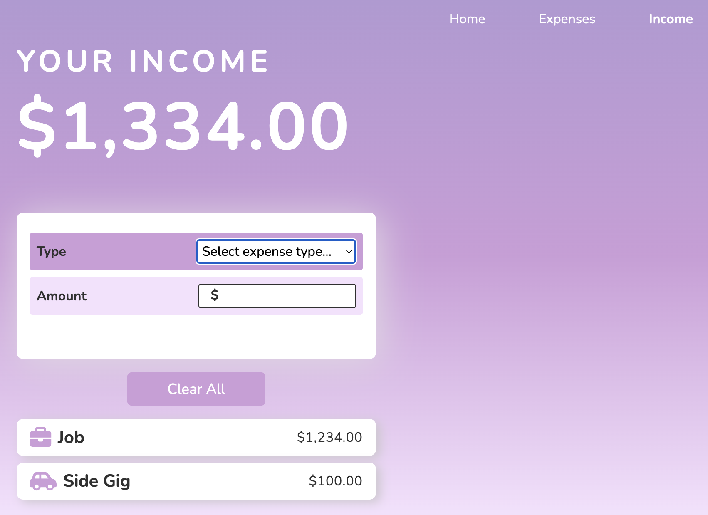

# Saving Bucket

Saving Bucket is a simple web application designed to help users track their expenses and income conveniently. It allows users to manage their financial transactions efficiently and calculates the balance between income and expenses.

## Features
**Expense Tracking** - Users can input different types of expenses with associated amounts via a user-friendly form.


**Income Tracking:** - Similar to expenses, users can track their income with ease.


- **Expense and Income Lists:** All recorded expenses and income are displayed in a list format for easy reference.

- **Delete and Clear Options:** Users can delete individual expenses/incomes or clear the entire list as needed.

**Balance Calculation:** The home page shows the balance between total income and total expenses.


- **Local Storage:** User data is updated and saved in local storage, ensuring it's retained when returning to the website or refreshing.
  
## Getting Started

To run Saving Bucket properly, navigate to the Applications folder in your terminal:

1. Open Google Chrome with specific settings:

   ```bash
   open -n -a Google\ Chrome.app --args --user-data-dir="users/yourUserName/Applications" --disable-web-security
   ```
2. Open the **home.html** file in the Google Chrome window that has opened
## Technologies Used
- HTML
- CSS
- JavaScript

## Acknowledgments
- Developed as a side project while learning to code with FreeCodeCamp.
- Inspired by the need for a simple expense tracking tool.

## Contact Me
If you have any questions, comments, or suggestions, please don't hesitate to reach out. I'd love to hear from you!

**Chaley Boatmon**
- Email: **<u>chaleyboatmon@gmail.com</u>**
- GitHub: [<u>**chayboats**</u>](https://github.com/chayboats)

Thank you for visiting my repository!
